<!--Welcome-->

 

 <!--Profile view-->

  

<!--Follow-->

  

    <table width="100%" align="center" border="0">
        <tr>
            <td align="center">
            
            </td>
            <td align="center">
              
            </td>
        </tr>
    </table>   

<!-- Social -->

    <table width="100%" align="center" border="1">
        <tr>
            <td align="center">
                
            </td>
            <td align="center">
                
            </td>
        </tr>
    </table>   

<!--
-  💻 I’m currently working on ...
- 🌱 I’m currently learning ...
- 👯 I’m looking to collaborate on ...
- 🤔 I’m looking for help with ...
- 💬 Ask me about ...
- 📫 How to reach me: ...
- 😄 Pronouns: ...
- ⚡ Fun fact: ...
-->

<!--A little more about me-->
## A little more about [me...](https://github.com/muangau107)

- [x] 🔭 Right now, I'm working as a Software Engineer in Vietname
- [x] 🌱 Always learning something new...
- [x] 👀 I’m interested in programming, data and security
- [x] 📫 How to reach me **[email](mailto:muangau107@gmail.com)**  🌸 🌸 🌸 🌸 🌸 🌸 🌸

<!--Connect with me-->
<h2 align="left">🌐 Connect with me:</h2>

<!--Languages and Tools-->
<h2 align="left">💻 Languages and Tools:</h2>

<table align="center">
  <tr>
    <td align="center" width="96">
        
       React
    </td>
    <td align="center" width="96">
        
       JavaScript
    </td>
    <td align="center" width="96">
        
       C++
    </td>
        <td align="center" width="96">
        
       C#
    </td>
    <td align="center" width="96">
        
       MySQL
    </td>
    <td align="center"  width="96">
        
       Bootstrap
    </td>
          <td align="center" width="96">
        
       Github
    </td>  
    <td align="center"  width="96">
        
       HTML5
    </td>
    <td align="center" width="96">
        
       CSS
    </td>
  </tr>

 <tr>
     <td align="center" width="96">
        
       PostgreSQL
    </td>
    <td align="center" width="96">
        
       PHP
    </td>
            <td align="center" width="96">
        
       VsCode
    </td>
              <td align="center" width="96">
        
       WordPress
    </td>
    <td align="center" width="96">
    </td>
    <td align="center" width="96">
      </td>
    <td align="center" width="96">
    </td>
    <td align="center" width="96">
    </td>
    <td align="center" width="96">
    </td>

 </tr>
</table>
  

    
 

 
##  Current Streaks

    

 

##  My Github Stats

 

    
    

  

