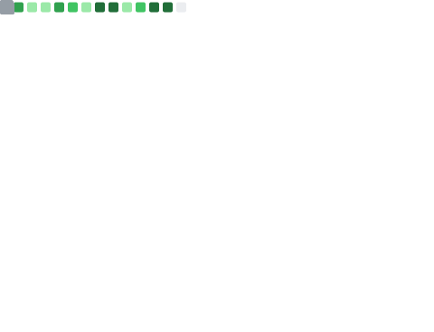

<!--
[](https://git.io/typing-svg)
-->
[](https://git.io/typing-svg)

<p align="left">  </p>


 <div align=center>
    &nbsp;&nbsp;&nbsp;
    <a href="https://github.com/muangau107">
        
     </a>
</div>

<!--
-  💻 I’m currently working on ...
- 🌱 I’m currently learning ...
- 👯 I’m looking to collaborate on ...
- 🤔 I’m looking for help with ...
- 💬 Ask me about ...
- 📫 How to reach me: ...
- 😄 Pronouns: ...
- ⚡ Fun fact: ...
-->

## A little more about [me...](https://github.com/muangau107)

- [x] 🔭 Right now, I'm working as a Software Engineer in Vietname
- [x] 🌱 Always learning something new...
- [x] 👀 I’m interested in programming, data and security
- [x] 📫 How to reach me **[email](mailto:muangau107@gmail.com)**  🌸 🌸 🌸 🌸 🌸 🌸 🌸

<!--
```yaml
{
  "code": ["C++", "C#", "HTML", "CSS", "JavaScript"],
  "database": ["SQL", "mysql", "SQLite", "PostgreSQL"],
  "ide": ["vs code", 'Visual Studio'],                     
  "others": ["HTML5", "CSS3", "Github"]
}
```
-->


<h2 align="left">🌐 Connect with me:</h2>

<p align="left">
<a href="https://twitter.com/muangau107" target="blank"></a>
<a href="https://fb.com/ngauit" target="blank"></a>
<a href="https://instagram.com/muangau107" target="blank"></a>
<br/><br/>

<h2 align="left">💻 Languages and Tools:</h2>


<p align="left"> <a href="https://getbootstrap.com" target="_blank" rel="noreferrer">  </a> <a href="https://www.w3schools.com/cpp/" target="_blank" rel="noreferrer">  </a> <a href="https://www.w3schools.com/cs/" target="_blank" rel="noreferrer">  </a> <a href="https://www.w3schools.com/css/" target="_blank" rel="noreferrer">  </a> <a href="https://dotnet.microsoft.com/" target="_blank" rel="noreferrer">  </a>  <a href="https://hadoop.apache.org/" target="_blank" rel="noreferrer">  </a> <a href="https://hive.apache.org/" target="_blank" rel="noreferrer">  </a> <a href="https://www.w3.org/html/" target="_blank" rel="noreferrer">  </a> <a href="https://developer.mozilla.org/en-US/docs/Web/JavaScript" target="_blank" rel="noreferrer">  </a> <a href="https://www.linux.org/" target="_blank" rel="noreferrer">  </a> <a href="https://www.microsoft.com/en-us/sql-server" target="_blank" rel="noreferrer">  </a> <a href="https://www.mysql.com/" target="_blank" rel="noreferrer">  </a> <a href="https://www.photoshop.com/en" target="_blank" rel="noreferrer">  </a> <a href="https://www.php.net" target="_blank" rel="noreferrer">  </a> <a href="https://www.postgresql.org" target="_blank" rel="noreferrer">  </a> <a href="https://postman.com" target="_blank" rel="noreferrer">  </a> <a href="https://reactjs.org/" target="_blank" rel="noreferrer">  </a>  <a href="https://www.sqlite.org/" target="_blank" rel="noreferrer">  </a> <a href="https://dotnet.microsoft.com/apps/xamarin" target="_blank" rel="noreferrer">  </a> </p>

<div align="center">
    
 </div>


##  Current Streaks

<p align="center">
    <a href="https://github-readme-streak-stats.herokuapp.com/?user=muangau107&theme=black-ice&hide_border=true&stroke=0000&background=060A0CD0">
        
    </a>
</p><br/>

##  My Github Stats


 <p align="center">
    <a href="https://github-readme-stats.vercel.app/api?username=muangau107&show_icons=true&count_private=true&theme=react&hide_border=true&bg_color=060A0CD0"></a>
    </p>
  
[](https://github.com/muangau107)
